# Python + Google Sheet + Pandas
 
## __Você irá aprender como capturar seus arquivos do Google Sheets e transformar em um DataFrame Pandas para dar andamento em suas análises.__ 
 
 
Vou dividir em três sessões as explicações:
* __Preparando seu ambiente__: Aqui explico os passos iniciais que precisamos realizar para fazer a ponte entre nosso código e a planilha.
* __Autenticação local__: Método mais simples para autenticar e coletar os dados.
* __Autenticação por conta de serviço__: Aqui criamos uma conta de serviço para autenticação.
 
Irei passar um detalhamento sobre cada passo que iremos realizar e explicar o motivo de cada um.<br>
_Se você quer apenas ver o código rodar sem entender as coisas funcionam, [te indico esse link](https://developers.google.com/sheets/api/quickstart/python)._
 
--- 
## __Breve resumo:__


 
# __Preparando seu ambiente__
 
> Esse passo a passo é __obrigatório__, sem isso nosso projeto não funciona. Vamos criar um projeto no painel do google developers e ativar a API do Google Sheets. 
 
## 1. Criar um projeto no Google Developer Console
 
Link: https://console.developers.google.com/project
> Clique na opção + Criar Projeto<br>
 

 
 > Defina um nome para o seu projeto
 
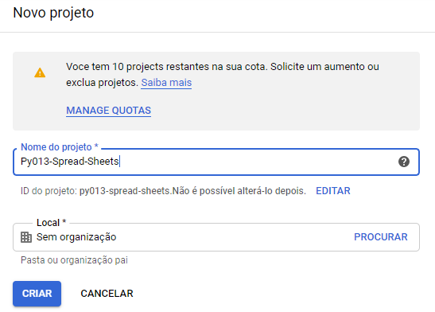
 
## 2. Ativando Google Sheets API
 Com nosso projeto criado, vamos habilitar a API.
 
 > Na barra de pesquisa, digite: Google Sheets API
 

 
 > Seleciona a opção __Ativar__
 
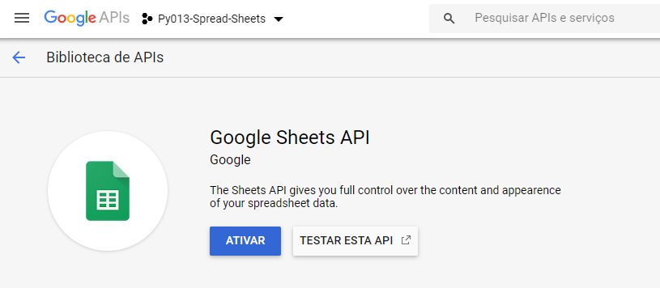
 
## 3. Configurando o consentimento OAuth
 Precisamos definir se nossa autenticação será __Interna__ _(Apenas para usuários da organização do seu projeto)_ ou __Externa__ _(Abrange todo mundo)_.
 
> Nesse exemplo eu selecionei a opção __Externa__
 
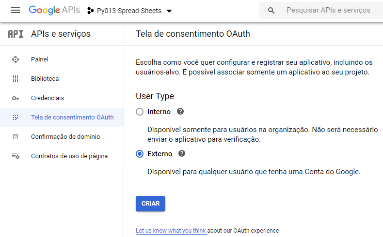
 
> Precisamos definir um nome para o aplicativo. _Assim iremos sabem onde está sendo feito a autenticação_
 
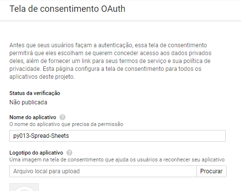
 
---
>Até aqui:
>### Criamos o alicerce para nosso código. Temos um projeto criado no google developers e a API do sheets ativada.<br>
>### Agora precisamos definir nosso método de autenticação.
>### Siga o passo a passo até o final, se for a primeira vez que está realizando esse experimento, caso já tenha familiaridade escolha o que lhe melhor atende.
 
---
 
# __Executando de forma local__
__Precisamos criar a chave de autenticação com o nosso projeto.__
 
## 1. Criando credenciais: Id do cliente OAuth
> Na página inicial do nosso projeto, clique em __credenciais__, __+ Criar Credenciais__ e selecione __ID Cliente OAuth__
 
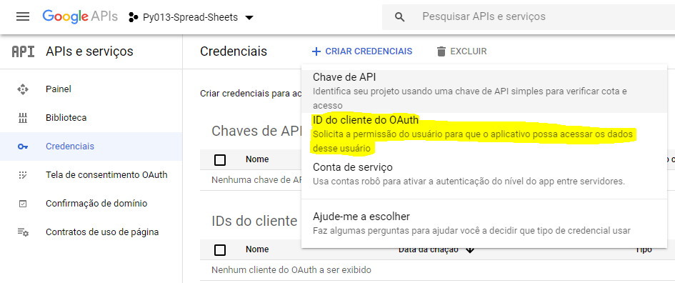
 
> Selecione a opção do dispositivo que irá fazer a autenticação, no nosso caso: __App para computador__ 
 
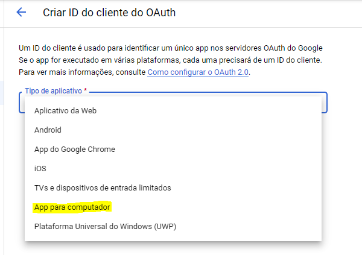
 
> Faça o download do seu arquivo com as credenciais. <br>
> Coloque seu arquivo .json na pasta do seu projeto! Você pode renomear seu arquivo.
 

 
### __Agora que já temos nossa chave de autenticação, pode codificar a captura dos dados.__ 
 
## 2. Instalando a lib 
> No Jupyter Notebook, faça a instalação dessa lib:
 
```
!pip install --upgrade google-api-python-client google-auth-httplib2 google-auth-oauthlib
```
 
## 3. Lendo uma planilha de exemplo do Google
O Google nos fornece um código de teste, para vermos se nossas credenciais estão funcionando.<br>
### Exemplo completo aqui: __01_GS.ipynb__<br>
_Para mais detalhes: https://developers.google.com/sheets/api/quickstart/python_
 
__Código de Exemplo do Google__
```
from __future__ import print_function
import pickle
import os.path
from googleapiclient.discovery import build
from google_auth_oauthlib.flow import InstalledAppFlow
from google.auth.transport.requests import Request
 
# If modifying these scopes, delete the file token.pickle.
SCOPES = ['https://www.googleapis.com/auth/spreadsheets.readonly']
 
# The ID and range of a sample spreadsheet.
SAMPLE_SPREADSHEET_ID = '1BxiMVs0XRA5nFMdKvBdBZjgmUUqptlbs74OgvE2upms'
SAMPLE_RANGE_NAME = 'Class Data!A2:E'
 
def main():
    """Shows basic usage of the Sheets API.
    Prints values from a sample spreadsheet.
    """
    creds = None
    # The file token.pickle stores the user's access and refresh tokens, and is
    # created automatically when the authorization flow completes for the first
    # time.
    if os.path.exists('token.pickle'):
        with open('token.pickle', 'rb') as token:
            creds = pickle.load(token)
    # If there are no (valid) credentials available, let the user log in.
    if not creds or not creds.valid:
        if creds and creds.expired and creds.refresh_token:
            creds.refresh(Request())
        else:
            flow = InstalledAppFlow.from_client_secrets_file(
                'NOME_DA_SUA_CREDENCIAL.json', SCOPES)
            creds = flow.run_local_server(port=0)
        # Save the credentials for the next run
        with open('token.pickle', 'wb') as token:
            pickle.dump(creds, token)
 
    service = build('sheets', 'v4', credentials=creds)
 
    # Call the Sheets API
    sheet = service.spreadsheets()
    result = sheet.values().get(spreadsheetId=SAMPLE_SPREADSHEET_ID,
                                range=SAMPLE_RANGE_NAME).execute()
    values = result.get('values', [])
 
    if not values:
        print('No data found.')
    else:
        print('Name, Major:')
        for row in values:
            # Print columns A and E, which correspond to indices 0 and 4.
            print('%s, %s' % (row[0], row[4]))
 
if __name__ == '__main__':
    main()
```
 
Após executar esse código a primeira vez, o Google irá solicitar sua aprovação para autenticar.
 
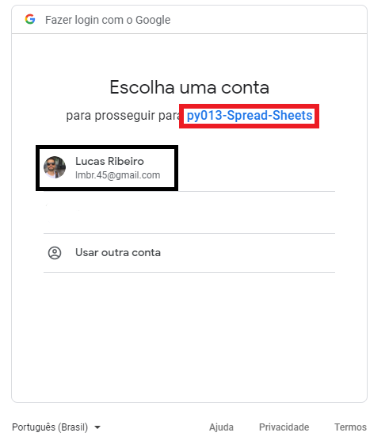
 
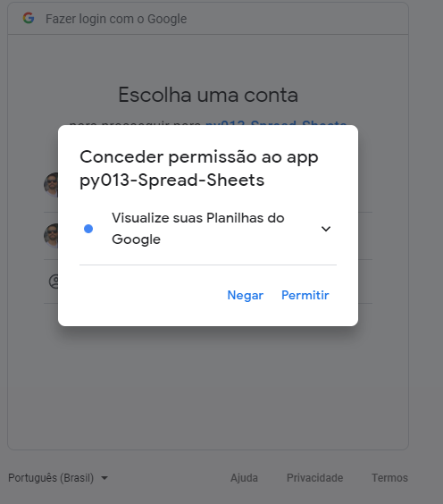
 
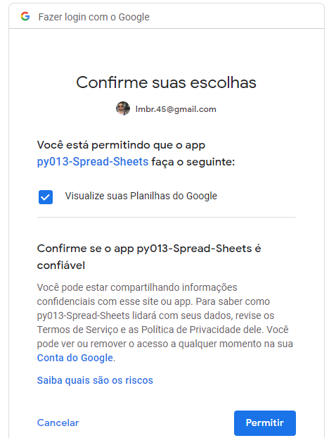
 
 
> Processo de autenticação realizado com sucesso:
 

 
Retornando para nosso notebook:
 
Perceba que tivemos sucesso em nossa autenticação e leitura da planilha.
 
Como retorno temos os dados da planilha e o link de autenticação que foi utilizado nos passos anteriores.

 
> Após todo esse processo, o Google gerou um arquivo chamado __token.pickle__. <br>
> Esse arquivo serve para que não tenhamos que a cada execução realizar o processo de aceitação na autenticação.<br>
> Nesse arquivo ficam algumas chaves para automatizar o processo de autenticação.
 
## 4. Lendo uma planilha própria
 
O que fizemos até aqui:
* Criamos um projeto no Google.
* Habilitamos a API do Google Sheets.
* Criamos uma chave para executar local.
* Habilitamos a autenticação contínua. _arquivo token pickle_.
 
O que queremos agora:<br>
__Ler uma planilha específica e que o retorno seja um DataFrame do Pandas__
<br> Exemplo completo aqui: __02_GS.ipynb__
 
Vamos precisar de duas informações:
 
1. __Id da Planilha do Google Sheets__

 
2. __Nome da guia que queremos ler.__
 
Vamos precisar fazer uma modificação no script que o Google nos forneceu, para que o retorno seja um DataFrame :)
 
Antes:
```
SAMPLE_SPREADSHEET_ID = '1BxiMVs0XRA5nFMdKvBdBZjgmUUqptlbs74OgvE2upms'
SAMPLE_RANGE_NAME = 'Class Data!A2:E'
 
    if not values:
        print('No data found.')
    else:
        print('Name, Major:')
        for row in values:
            print('%s, %s' % (row[0], row[4]))
```
 
**DEPOIS:**
```
sample_spreadsheet_id = "1GYyp6cLDAhUDFz-itEUmp5lVxpqBJrj0075fjVVk7yM"
sample_range_name = "Página1"
 
    if not values:
        print('No data found.')
    else:
        # O retorno da API coloco como um DF
 
        df = pd.DataFrame(values)
        # Coloco a linha 1 como cabeçalho
        df.columns = df.iloc[0]
 
        # Remover a linha 1, nosso cabeçalho
        df.drop(df.index[0], inplace=True) 
 
        # Retorno o Dataframe
        return df
```
 
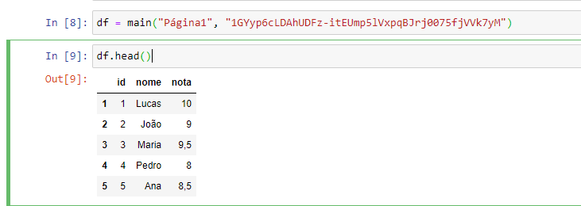
 
---
> Até aqui:
> ### __Já sabemos com autenticar e ler uma planilha convertendo para DataFrame. Mas temo um arquivo manual com as nossas credenciais. O ideal é termos chaves de serviço para não ter problemas.__
---
 
# __Executando com uma conta de serviço__
 
Após realizarmos os testes locais, queremos levar nosso projeto para produção ou automatizar o processo de leitura.
 
## 1. Criando uma credencial para conta de serviço
> Aqui selecionamos o opção: __Conta de Serviço__
 
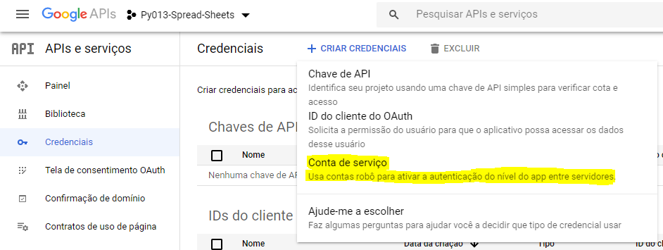
 
> Precisamos dar um nome nossa chave
 

 
> Os demais passos não são obrigatórios, então podemos pular rs ... 
 
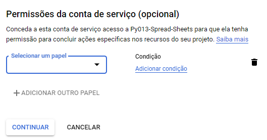 <br>
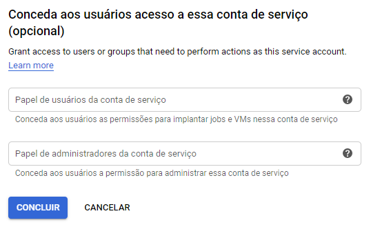
 
> __Credencial criada com sucesso__
 

 
## 2. Criar uma key de autenticação
 
> Clicando na credencial que criamos, vamos na opção __Chaves__.
 
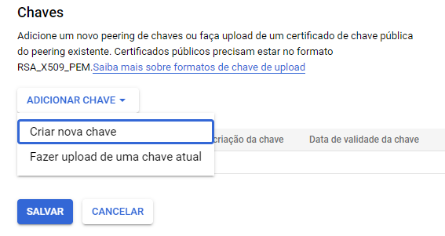
 
> Eu indico criar no formato ```.json``` 
 
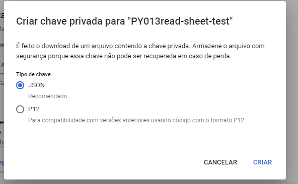
 
> Chave criada, será feito um download da chave. <br> 
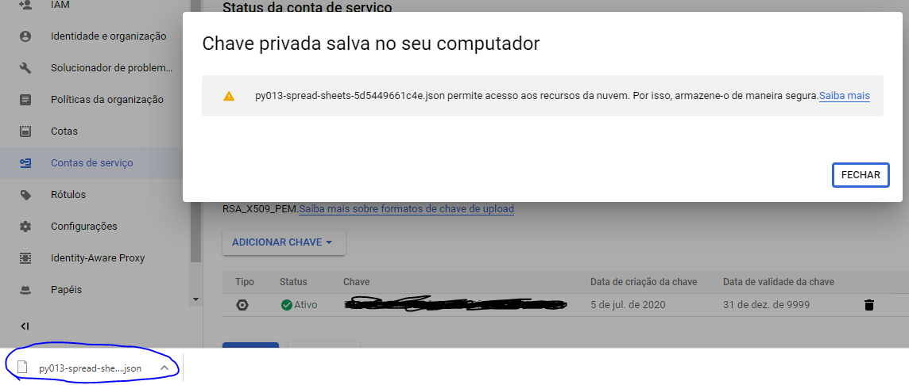
 
## Acesso ao e-mail de serviço 
Precisamos conceder acesso ao e-mail criado na planilha queremos acessar. _Em nossa credencial criada, foi gerado um e-mail._
 
> Pegamos esse e-mail na conta de serviço criada.
 
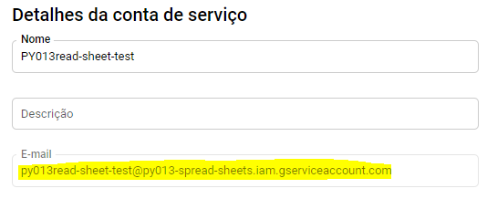
 
> Na planilha, adicionamos o e-mail.
 
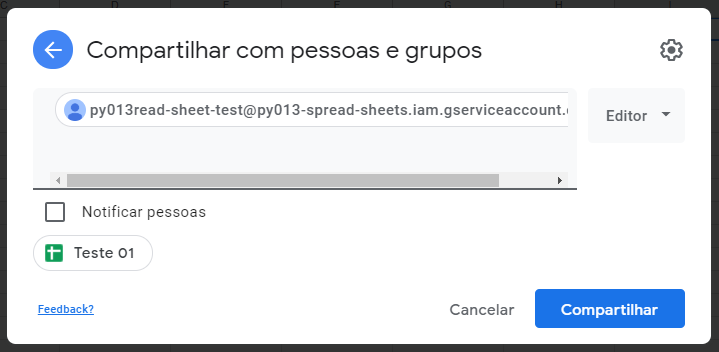
 
## 3. Vamos pro código
Links de referência: <br>
https://gspread.readthedocs.io/en/latest/oauth2.html
https://oauth2client.readthedocs.io/en/latest/index.html
 
Vamos precisar usar outras libs:
 
```
!pip install gspread
!pip install oauth2client
``` 
Temos duas opções: Autenticar direto com o __arquivo de credenciais__ ou __criar um dicionário com essas chaves.
 
### Exemplo completo aqui: __03_GS.ipynb__ & __04_GS.ipynb__
 
A alteração é bem simples para cada um.
 
__Arquivo de credenciais__
```
from google.oauth2.service_account import Credentials
 
credentials = Credentials.from_service_account_file(
    'nome-da-sua-credencial.json',
    scopes=scopes
)
```
 
__Dicionário__
```
from oauth2client.service_account import ServiceAccountCredentials
 
permission = ServiceAccountCredentials.from_json_keyfile_dict(credentials, scopes)
``` 